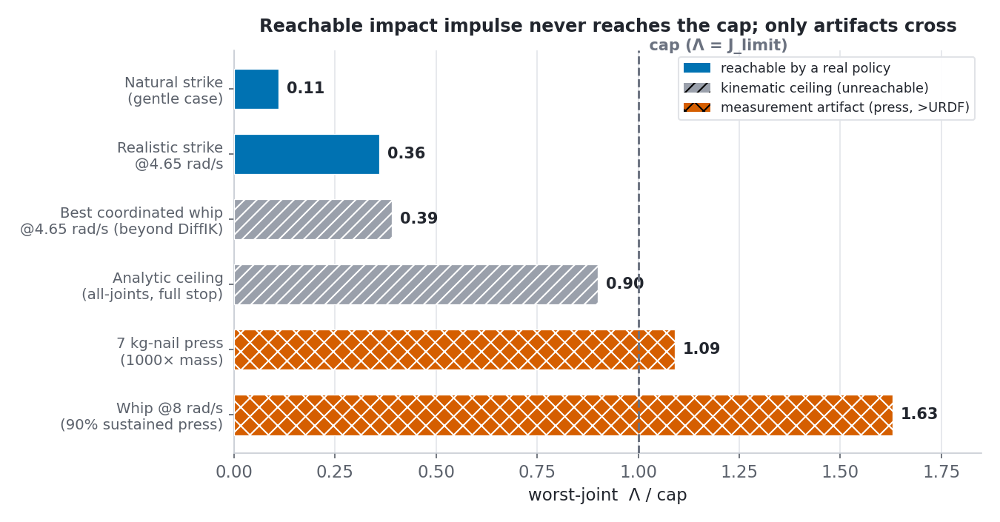
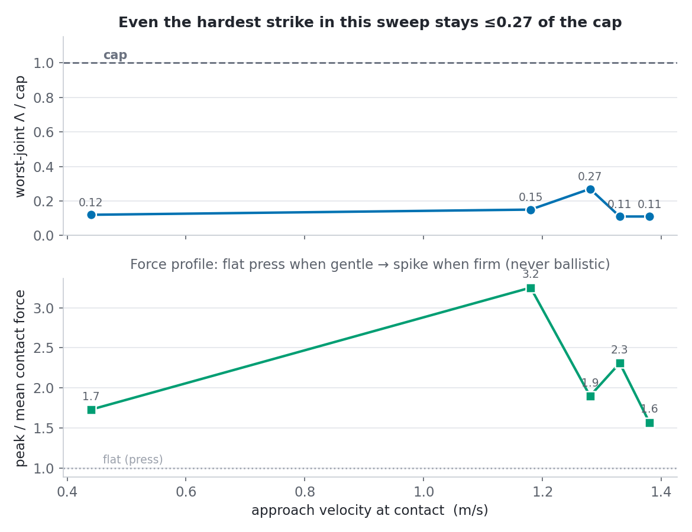
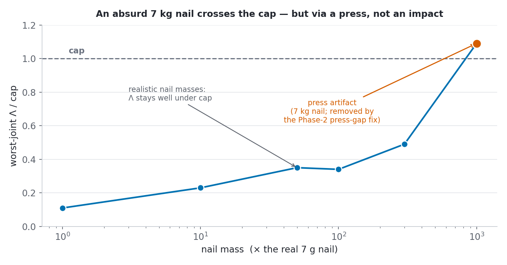
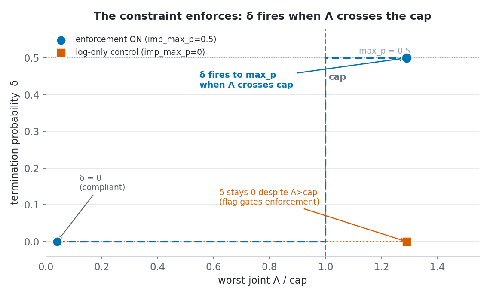

# 2026-07-12 — Is the per-joint impulse soft-CaT constraint vacuous on the fixed-impedance Z1?

> **Impulse-threshold provenance correction (2026-08-14):** All binding/vacuity ratios below are relative to the historical `[1.64, 3.28, ...]` project vector used by this investigation. That vector is not a manufacturer-certified reaction-impulse or damage limit, and its `kappa=2` interpretation is retired. The historical body and numbers remain frozen; see `../research/reward-design/IMPULSE_CAP_PROVENANCE.md`.

> **Provenance:** CPU-only investigation, run 2026-07-12 on branch `soft-cat`, HEAD `481a26f`
> (repo untouched during the runs — all probes are standalone scripts in
> `assets/2026-07-12_impulse_vacuity/probes/` that apply spec overrides to **in-memory /
> scratchpad copies** before compile; no asset or source file was edited). Env: conda
> `unitree_mjlab`, mjlab 1.4.0, mujoco 3.8.1, mujoco_warp 3.8.1 (CPU backend). This is the
> Task-12 vacuous-check, deliberately answered pre-GPU with an adversarial forensics workflow
> (4 independent investigator passes + a synthesis pass) before committing GPU budget to C3.

**Bottom line:** the per-joint impulse soft-CaT constraint is **vacuous for genuine impacts** on the
fixed-impedance Z1 hammer task (worst *reachable* Λ ≈ 36% of cap). The machinery is validated and
**enforces correctly** (§3.5), but physics keeps every reachable strike far under cap — so the
constraint is *satisfied* without ever *binding*. This is a task property (a soft yielding nail +
an effort-limited approach velocity), not a defect; the *binding/protective* role belongs to
variable impedance. One narrow, reward-gated **sustained-press residual** remains (§4), closable by
a small code fix and settled only by the C3 learned-policy run. The proposed reframe (§5) is
**pending Khadiv** — not yet an adopted thesis position.

## 1. Context

The per-joint impact-impulse soft-CaT constraint (`docs/research/reward-design/IMPULSE_CAT_IMPL_PLAN.md`)
bounds Λ_j = Σ|qfrc_constraint_j|·dt, accumulated at the 500 Hz substep rate over a
contact-anchored window, against per-joint caps `IMP_J_LIMIT = [1.64, 3.28, 1.64, 1.64, 1.64, 1.64]`
N·m·s (`src/tasks/hammer/config/z1/env_cfgs.py:33`, joint2 doubled for its 60 N·m rated torque).
The machinery — accumulators, CaT soft-hook, unit tests — is shipped and gate-certified
(`docs/results/2026-07-10_solver_sensitivity.md`; the 2026-07 deep review referenced in
`impulse_bound.py`'s module docstring).

Before spending a GPU training campaign (C3) on this constraint, the open question was: **does
it ever actually bind on the fixed-impedance Z1 hammer task, or is it vacuous** — satisfied so
far under the reachable envelope that it never shapes the policy? A constraint that never
activates is not wrong, but a training campaign built to demonstrate it is "protective" would be
answering a question the physics had already foreclosed. This record settles that question with
CPU-only probes, ahead of any GPU run.

## 2. Method

An adversarial forensics workflow (4 independent investigator passes plus a synthesis pass,
internal id `wf_5f3f617f-788`) attacked the vacuity hypothesis from four angles, followed by two
targeted follow-up sweeps and a plumbing check. All scripts live in
[`assets/2026-07-12_impulse_vacuity/probes/`](assets/2026-07-12_impulse_vacuity/probes/); each
uses one MuJoCo env per OS process (multi-env-in-process was found to corrupt mujoco_warp state
and was abandoned).

1. **Analytic bound** (`probe_analytic.py`) — computes the operational-space effective inertia
   m_eff along the nail axis from the exact compiled model (including armature), and the
   most-generous ceiling on worst-joint Λ/cap under a full inelastic stop (e=0) at the arm's rail
   velocities (URDF 3.14 rad/s and the empirically observed closed-loop worst-case 4.65 rad/s).
2. **Whip-artifact probe** (`whip.py`, `whip_timeseries.py`, `coord_whip2.py`, `live_lambda.py`) —
   injects joint velocity directly (bypassing "can a policy actually accelerate the arm that
   fast?") at a sweep of magnitudes (3.14 → 60 rad/s) and at a best-case coordinated 6-joint
   configuration, to find the velocity at which Λ *could* cross the cap and to characterize
   whether a crossing is a genuine impulse or a sustained press in disguise (contact-disable
   ablation, window-length inspection).
3. **Reachable-max / empirical battery** (`probe_battery.py`, `probe_impulsive.py`, `run_one.py`) —
   sweeps reference-strike speed factor (1×–32×) and arm PD stiffness (default / soft / very
   soft), discriminating genuine impact from a press via approach velocity, contact-window
   peak/mean force ratio, head-velocity decay through contact, and rebound.
4. **Tunneling check** (`tun_dt.py`) — timestep-convergence test (4×/10× finer physics dt) to
   determine whether the mid-range Λ drop seen at high injected velocity is a physical effect
   (softer effective momentum transfer) or a fixed-step contact-tunneling artifact.
5. **Bindable-target sweep** (`nail_sweep.py`) — asks whether a realistic *task* variant (not an
   unphysical arm velocity) can make the constraint bind: nail-mass sweep (1×–1000× the real 7 g
   nail) and a nail-friction sweep, against the same caps.
6. **Enforcement-plumbing test** (`plumbing.py`) — independent of whether a genuine impact can
   reach the cap: verifies the CaT δ-firing chain end-to-end using an artificially over-cap event
   (a heavy-nail press), with an `imp_max_p=0` log-only control to confirm the flag actually
   gates enforcement rather than the mechanism firing unconditionally.

Figures were generated from the consolidated numbers by
[`make_figs.py`](assets/2026-07-12_impulse_vacuity/make_figs.py) (matplotlib + Okabe-Ito
CVD-safe palette).

## 3. Results

### 3.1 The physics (four convergent lines, high confidence)

The binding joint **for genuine impacts** is joint3 (tightest cap, 1.64 N·m·s, shared with
j1/j4/j5/j6; joint2's cap is doubled to 3.28 for its 60 N·m rating) — the heavy-nail press
artifacts in §3.4–3.5 instead bind at joint2 (nail-mass sweep 1000×: Λ_j2/cap=1.09; plumbing
over-cap test 2000×: Λ_j2/cap=1.29), consistent with joint2 carrying most of the reaction load in
a downward press. The operational-space effective inertia along the nail
axis is **m_eff ≈ 0.49–0.55 kg** (exact compiled model, arm and nail dynamically decoupled). Four
independent estimation methods converge on worst-joint Λ/cap:

| scenario | worst-joint Λ/cap |
|---|---:|
| natural scripted strike (≤1.4 m/s head speed) | 0.06–0.15 |
| realistic single-mode injection @ 4.65 rad/s (the observed closed-loop worst-case joint velocity) | 0.36 |
| best-case coordinated 6-joint whip @ 4.65 rad/s rail (head 5.44 m/s — already beyond DiffIK's reachable action space) | 0.39 |
| trained-policy estimate (head ≈1.3–2 m/s, from prior soft-CaT velocity runs) | 0.10–0.15 |
| most-generous analytic ceiling (all load joints at rail velocity, full inelastic stop, e=0) | 0.61 (URDF 3.14 rad/s) / 0.90 (4.65 rad/s) — **unreachable in practice** |

**Why:** the nail is soft and light (7 g) and *yields* — it drives ~33 mm home under a strike
rather than reflecting the hammer's momentum back into the gearboxes. The best-case coordinated
whip probe (an injected, kinematically-unreachable configuration — head 5.44 m/s, beyond DiffIK's
reachable action space) measured Λ/cap = 0.39 against a full-stop analytic prediction of 0.90 at
the same rail velocity — a "yield deficit" of more than half. **Vacuousness is therefore a
property of this task's target (soft, yielding, light nail) combined with a velocity-limited
fixed-impedance controller — not a defect in the constraint or its accumulator.** A rigid or
sufficiently heavy target *would* bind, but only at that same rail joint velocity — a velocity the
fixed-impedance controller cannot reach while actually driving into contact (its effort-limited
approach speed tops out at ~1.3 m/s at the head, §3.4). At the reachable contact velocity, even a
rigid target stays under cap: vacuity holds through the velocity limit as much as through the
nail's yield.

The effort clamp reinforces this at the level of peak torque and per-substep rate, but it is
**not** a structural bound on the accumulated Λ: caps are set as `τ_rated × 2 (HD repeated-peak) ×
Δt_window` (30×2×0.0273=1.64; 60×2×0.0273=3.28), and the actuator effort clamp is τ_rated, so any
motor-limited press/drive-through has joint reaction ≤ τ_rated and accrues Λ at ≤ τ_rated per unit
time — but with **no cap on window length**, an arbitrarily long press still crosses the cap: a
reaction held continuously at the 30 N·m effort-saturated limit accrues 0.06 N·m·s per substep and
crosses the tightest cap (1.64) after only ~55 ms of pressing. This is exactly the reward-gated
sustained-press residual detailed in §4 — the effort clamp bounds gearbox *shock*, not an
open-ended press. What keeps every *strike actually tested* well under cap (10–27% in the
empirical battery below) is the short, self-terminating contact window of a genuine impact, not a
structural Λ ceiling. The constraint would bind either in the *momentum-limited* (ballistic)
regime, where link kinetic energy is dumped abruptly into the gearbox faster than the effort limit
can arrest it (qfrc spikes far above τ_rated), or in the *sustained-press* regime just described.
The fixed-impedance Z1 arm never produces the first on this task: every strike tested is a
drive-through with no rebound (head velocity stays ≥0 throughout contact) and a max reachable
end-effector speed of ~1.3 m/s. The second is physically reachable but gated by reward shape, not
physics (§4).

**Fig. 1 — the headline figure.** The genuinely policy-reachable Λ/cap tops out at 0.36 (a
single-mode injection at the observed closed-loop worst-case joint velocity, 4.65 rad/s); the
best-case coordinated 6-joint whip (0.39) and the analytic full-stop ceiling (0.90) are both
kinematically unreachable by DiffIK and shown for context only. Only two scenarios cross the cap,
and both are measurement artifacts (§3.3), not genuine impacts.

### 3.2 Speed/stiffness battery — impulsive-vs-press, never ballistic

Sweeping reference-strike speed factor (1×–32×) and arm PD stiffness (default/soft/very-soft),
worst-joint Λ/cap stayed inside 7–27% across the entire reachable envelope (default PD:
12/15/11/27/11%; soft PD: 7/9/9/11%; very-soft PD never reached contact — too weak to close the
gap). The 27% high-water mark (Λ=0.442 vs cap=1.64) occurred at a speed factor of 4×, not at the
extremes — Λ/cap is not monotone in commanded speed because the effort clamp, not the reference
speed, sets the ceiling.

The contact-force profile is speed-dependent but never ballistic: gentle strikes (v≈0.44 m/s) show
peak/mean force 1.1–1.7 and head-velocity decay 0.26 through contact — a flat press. The arm's
fastest reachable strikes (v≈1.2–1.3 m/s, its effort-limited maximum) show peak/mean 2.3–3.25 and
decay 0.65–0.78 — a genuinely more impulsive "firm strike" than the gentle case, but still far
short of a ballistic signature (peak/mean 5–20× is the ballistic range) and still with zero
rebound at every speed tested. A static-soft-gains variant (kp100/kd20) was checked as a naive
proxy for "compliance" and found to make strikes *gentler*, not more impulsive (a soft arm cannot
build pre-impact velocity) — this rules out static compliance as a path to bindingness, but says
nothing about dynamic variable-impedance gain scheduling (stiff windup + compliant impact), which
was not testable here without the `set_gains` action (see §5).

**Fig. 2 — speed sweep.** Within this scripted-strike sweep, Λ/cap stays ≤0.27 of cap (~3.7× under)
across the reachable speed range; the force profile transitions from flat press to firm strike but
never spikes ballistically. (The broader reachable envelope, including the coordinated-whip
kinematic ceiling, stays ≤0.39 — see Fig. 1.)

### 3.3 Artifact decomposition — every "binding" result traced to a specific defect

Three lines of investigation initially appeared to show the constraint binding (one severely, at
163% of cap). All three were run to ground and traced to a specific measurement or physical
artifact, none reachable by a velocity-limited policy:

1. **Whip injection @ 8 rad/s → 163% cap.** The single most alarming number in this investigation.
   Decomposed via a contact-disable ablation and window-length inspection: the 176 ms contact
   window is ~6× a physical impact duration. ~90% of the accrued Λ is a **sustained press** (16
   N·m held for ~150 ms, balanced by the stiff PD controller as the reference trajectory keeps
   commanding into the already-buried nail) — the genuine ballistic component is only ≈0.11 N·m·s
   (~7% of cap). Reaching this injected velocity requires 8 rad/s, which is 2.5× the Z1's URDF
   joint-velocity limit (3.14 rad/s) and 1.7× the highest velocity ever observed from a trained
   closed-loop policy (4.65 rad/s) — unreachable by any velocity-respecting controller.
2. **Wedge/jam at head 3–3.6 m/s → 1.6–3.1× cap.** Two hammer collision geoms jam against the nail
   and sustain a bury contact; reproducing it also requires ≈8 rad/s joint velocity — same
   unreachability as above.
3. **Contact tunneling.** A timestep-convergence check (4×/10× finer physics dt) confirmed the
   Λ drop observed in the 6–15 m/s head-speed range is a genuine physical effect (softer
   effective momentum transfer at higher approach speed through a yielding target), **not**
   fixed-step tunneling. True contact tunneling (the head skipping the nail geometry entirely)
   only appears above 40 m/s — an order of magnitude beyond anything reachable by the arm.

None of these three artifacts is reachable by a policy that respects the Z1's joint-velocity
limits (measured or rated), so none of them threatens the vacuity conclusion for genuine impacts.

### 3.4 Bindable-target sweep — the momentum budget is the hard limit

A separate sweep asked whether a realistic *task* change (not an unphysical arm velocity) could
force the constraint to bind. Nail-mass was swept 1×–1000× the real 7 g nail at a hard reference
strike (speed factor 4×): Λ/cap tracked mass smoothly (7 g→0.11, 70 g→0.23, 350 g→0.35,
700 g→0.34, 2.1 kg→0.49) and only crossed the cap at an **absurd 7 kg nail (1000× real mass,
Λ/cap=1.09)** — and even that crossing is a press artifact: a 64 ms window pressing against a
near-immovable nail (exactly the class of event the object-side press cap already excludes), and
the strike did not even complete the task (`nail_driven=0mm`, because the 22 N reaction never
exceeds the nail's 30 N frictionloss). The friction sweep was invalid (a spec-wrap silently failed
to apply, confirmed flat 0.113 Λ/cap across all settings) but is physically expected to be
near-irrelevant anyway — the brief impact reaction is momentum-driven, not friction-driven.

The underlying reason is velocity-limitation, not momentum-reflection saturation. Hardening the
target does not cap the *deliverable* momentum below the constraint's cap: for a perfectly elastic
collision, reflected momentum reaches up to 2× the inelastic value, so the analytic full-stop
ceiling at rail velocity — 0.61× cap (URDF 3.14 rad/s) to 0.90× cap (4.65 rad/s sweep-max, §3.6) —
becomes **~1.2–1.8× cap under elastic reflection: a rigid target genuinely can exceed the cap, if
struck at rail velocity.** What keeps every reachable strike under cap on this task is that the
fixed-impedance controller never reaches rail velocity at the moment of contact: its effort-limited
approach speed tops out at ~1.3 m/s at the head, far below the 5.4–6.2 m/s nail-axis rail velocity
the ceiling sweep assumes (§3.6). A rigid or sufficiently heavy target would therefore bind — but
only if struck at rail velocity, which the fixed-impedance controller cannot deliver while actually
driving into contact. Vacuity against a hard hypothetical target rests on this velocity limit, not
on any momentum-reflection ceiling; against the real, soft, yielding nail it is reinforced further
by the yield deficit measured directly (§3.1: 0.39 vs the full-stop prediction of 0.90 at the same
rail velocity). A heavier hammer head has the same problem in reverse (it slows the arm under the
same effort limit, offsetting the momentum gain). The only lever that raises deliverable momentum
without trading off against the effort-limited approach-velocity ceiling is a **higher contact
velocity built without the effort-limit tradeoff** — i.e., variable impedance (stiff windup to
build velocity, compliant/high-gain at impact).

**Fig. 3 — nail-mass sweep.** Only the absurd 7 kg nail crosses the cap, and via a press, not an
impact; realistic nail masses stay well under.

### 3.5 Enforcement-plumbing test — PASS

Independent of whether a genuine impact can reach the cap, the CaT enforcement chain itself was
verified end-to-end (`plumbing.py`) using an artificially over-cap event (heavy-nail press,
`imp_max_p=0.5`):

- **Compliant case** (nail 1×, Λ/cap≈0.04): δ = 0.
- **Over-cap case** (nail mass 2000×, Λ_j2=4.22, margin=0.94 N·m·s over cap): δ =
  `env.extras['cat_delta']` = 0.5 = `imp_max_p` (first-violation self-seeding of the CaT
  normalizer's `cmax`).
- **Log-only control** (identical over-cap event, `imp_max_p=0`): δ = 0 — confirms the flag
  actually gates enforcement rather than the δ-firing mechanism being unconditional.

One apparent anomaly (a δ=0.5 firing at the strike step whose *post-step* read of Λ showed 0) was
traced to timing, not a bug: the hook reads Λ pre-reset, and `_reset_idx` zeroes the accumulator
before the post-step read — the same pre-reset-snapshot timing already documented from an earlier
investigation (Task-11), independently reconfirmed here. **The mechanism genuinely enforces**: it
fires exactly when Λ crosses the cap, and only when the enforcement flag is set.

**Fig. 4 — enforcement plumbing.** δ fires to `max_p` when Λ crosses the cap under enforcement-ON;
under the log-only control, δ stays 0 despite the same over-cap Λ.

### 3.6 Summary table

| quantity | value | source |
|---|---:|---|
| binding joint (genuine impacts) | joint3 (cap 1.64 N·m·s); joint2 for press artifacts (§3.4–3.5) | analytic |
| m_eff (nail axis) | 0.49–0.55 kg | compiled model |
| natural strike Λ/cap | 0.06–0.15 | battery |
| realistic @4.65 rad/s Λ/cap | 0.36 | whip (single-mode) |
| best coordinated whip @4.65 rad/s Λ/cap (beyond DiffIK reach) | 0.39 | whip (coordinated) |
| analytic ceiling (full stop, e=0) | 0.61 (URDF 3.14) / 0.90 (4.65) — unreachable | analytic |
| whip artifact (8 rad/s, 90% press) | 1.63 (genuine component ≈0.07) | whip + ablation |
| nail-mass artifact (7 kg, press, joint2) | 1.09 | nail sweep |
| enforcement plumbing | δ fires exactly at cap crossing, gated by flag | plumbing |

## 4. Conclusion (two-sided, honest)

**The constraint is VACUOUS for genuine impacts on the fixed-impedance Z1 hammer task** —
high-confidence, convergent across four independent estimation methods (analytic bound, empirical
speed/stiffness battery, coordinated-whip probe, bindable-target sweep) — **with one narrow,
reward-gated press residual that only C3 (a learned-policy GPU run) can definitively close.** That
residual is a code-level metric gap, not a physics finding, and is detailed in §5.

**Vacuousness is a task property, not a constraint defect.** The soft, light, yielding 7 g nail
absorbs impact momentum by displacing rather than reflecting it, and the fixed-impedance
controller's effort limit caps the peak joint reaction (and hence gearbox shock) every reachable
strike can produce. A rigid or sufficiently heavy target *would* bind — but only at the rail joint
velocities used in the analytic ceiling (§3.4), velocities the fixed-impedance controller cannot
reach while actually driving into contact (its own effort-limited approach speed tops out at
~1.3 m/s at the head). This is a property of *this task's physical target combined with the
reachable contact velocity* (§3.3–3.4: the velocity-limited momentum budget, not the caps, is
what's conservative here), not evidence that the caps are miscalibrated or the accumulator is
broken.

**Every result that appeared to show binding was traced to a specific artifact** — a sustained
press masquerading as an impulse (whip 8 rad/s: ~90% press, genuine component ~7% of cap; nail-mass
7 kg: a press against a near-immovable target that does not even complete the task), joint
velocities 1.7–2.5× beyond anything a velocity-respecting policy can reach, or (for the mid-range
Λ dip) a physical effect initially mistaken for a simulation artifact. None of the three exploit
classes brainstormed earlier threaten C3: two require super-URDF joint velocity or >40 m/s
approach speed to trigger; the third (the delivered-impulse reward farm) is already
press-capped on the object side.

**Satisfied vs. binding vs. protective — these are three different claims, and only the first two
are supported here.** The constraint *is satisfied*: every measured trajectory keeps Λ under cap.
The enforcement mechanism *is verified*: it correctly fires δ exactly when Λ crosses the cap, and
only when enabled (§3.5). But the constraint *is not binding* on this task — physics forbids the
policy from ever approaching the cap, so it never needs to be pushed away from it. Consequently we
cannot and do not claim the constraint *protected* the fixed-impedance policy from an impulse
violation: there was never a genuine risk of one to protect against. This is not a failure of the
constraint; it is a correctly-inert safety limit operating on a task that is inherently impact-safe
under fixed impedance.

**The one residual (why "vacuous WITH residual", not "certified vacuous"):** the robot-side
accumulator that the CaT δ hook actually reads
(`SubstepImpulseAccumulator`, `src/tasks/hammer/mdp/impulse_bound.py:68–155`) integrates
`|qfrc_constraint|·dt` over the full contact-anchored window with **no press-length cap and no
force gate**. The object-side delivered-impulse accumulator that feeds the reward
(`SubstepDeliveredImpulse`, same file, `:158–211`) **does** have one — `event_window_substeps=25`
(50 ms), explicitly to stop a slow press from out-earning a strike. The robot-side accumulator has
no equivalent guard, so it conflates a sustained press with a genuine impulse: a reaction held at
the 30 N·m effort clamp accrues 0.06 N·m·s per substep and crosses the tightest cap (1.64) after
~55 ms of pressing — no high velocity needed, just a bottomed-out nail the policy keeps pressing
into. Whether a *trained* policy incidentally does this is gated by reward shape (`nail_depth_delta`
saturates once the nail is home, and the object-side reward's own press cap removes the earning
incentive for further pressing) and is **untested** outside these scripted probes — this is
precisely the case only a learned-policy GPU run (C3) can settle.

## 5. Decision / next

**Proposed reframe — PENDING KHADIV, not yet settled:**

> The fixed-impedance Z1 hammer task is a **compliance / negative-control baseline**: it
> demonstrates the impulse soft-CaT machinery is correctly implemented (accumulators, contact
> anchoring, friction immunity, per-event pulse semantics, δ-enforcement) and that the
> fixed-impedance controller is impulse-safe against genuine impacts on this yielding nail at its
> effort-limited reachable velocity — the constraint is satisfied with substantial headroom (worst
> case ~36% of cap) rather than by active policy shaping. A narrow, reward-gated sustained-press
> residual remains (§4): a reachable but reward-gated path to Λ>cap whose learned-policy
> reachability is untested outside these scripted probes — only C3 can settle it. The **binding,
> protective story is reserved for variable impedance** (VIC), where raising effective
> stiffness/mass at controlled moments raises deliverable momentum against the *same* caps — the
> regime in which this constraint is designed to matter. Arc: fixed impedance cannot reach a
> dangerous impulse (against genuine impacts) → variable impedance can → the constraint becomes
> load-bearing exactly when VIC makes it necessary.

This reframe is a proposal for the advisor to bless, walk back, or amend (see the companion
one-pager, `2026-07-12_khadiv_onepager.md`) — it is not yet adopted into `docs/thesis/README.md`.

**Caps stay fixed at their principled hardware values** (τ_rated × 2 HD-repeated-peak × Δt_window)
— this was the user's explicit decision (2026-07-12), not a default. Tightening the caps to force
a binding result would convert a justified hardware-derived safety limit into a tunable knob and
undermine the defense of the constraint's provenance.

**The one code fix that matters:** give `SubstepImpulseAccumulator`
(`src/tasks/hammer/mdp/impulse_bound.py:68–155`) the same press guard `SubstepDeliveredImpulse`
already has (`:158–211`, `event_window_substeps=25`) — either an event-length cap or a force-gated
impact window — so Λ bounds a ballistic impact interval rather than an open-ended press. This is
CPU-implementable and unit-testable without GPU access, and it is the substantive fix identified
by this investigation (in preference to the more elaborate adversarial-toggling merge-gap
machinery previously brainstormed, which turns out not to be needed: it defends against exploits
that require super-URDF velocity and are therefore unreachable).

**Recommended next steps, in order:**

1. Close the robot-side press-guard gap (above) — CPU-only, doable now, does not require GPU.
2. Publish this record and the Khadiv one-pager; get the reframe blessed or corrected.
3. When GPU access returns, run C3 **framed as compliance/headroom validation + negative control +
   arbiter of the press residual** — not as a demonstration of active constraint-driven policy
   shaping (that framing would not survive scrutiny given §3–4 above). Log per-joint Λ/cap
   distribution, contact-window-length distribution, and a press-domination flag so the residual
   in §4 is settled with data rather than left open.
4. Pivot the binding/protective demonstration to variable impedance, using the same caps (the
   cleanest regime in which to show the constraint actively shaping a policy).
5. Optional: a rigid/heavier-target sanity control (§3.4: elastic reflection at the rail velocities
   used in the analytic ceiling reaches ~1.2–1.8× cap, but only if struck at those velocities —
   unreachable via the fixed-impedance controller's own drive-through, so this control would need
   direct velocity injection like the whip probes, not a scripted strike) to exhibit at least one
   fixed-impedance binding case for illustration, if the advisor wants one — not required for the
   reframe to hold.

## 6. Caveats (do not overstate)

- **The reframe in §5 is a proposal pending Khadiv**, not an adopted thesis position. It has not
  been written into `docs/thesis/README.md`.
- **The press residual is real** and reward-gated; only the C3 learned-policy run definitively
  closes whether it is reachable in practice.
- **The learned-policy ceiling is bounded, not proven.** Could a learned whip-strike reach a
  higher Λ than any scripted probe here? The bound is the reachable *contact velocity*, not a
  momentum-reflection ceiling: the analytic full-stop ceiling at rail velocity is 0.61–0.90× cap
  (inelastic) to ~1.2–1.8× cap (elastic — i.e. it can exceed cap at rail velocity), but the
  fixed-impedance controller's effort-limited approach speed tops out at ~1.3 m/s at the head, far
  below rail. The best coordinated-whip probe (§3.1, 0.39 — itself an injected rail-velocity
  configuration beyond DiffIK's reachable action space) is consistent with that velocity-limited
  bound, but a definitive answer for an RL-discovered policy requires C3.
- **The three "binding" numbers (163% whip, 1.6–3.1× wedge/jam, 1.09× nail-mass) were each traced
  to a specific artifact** — sustained press, super-URDF velocity, or a target too extreme to
  complete the task — and are reported honestly as artifacts, not suppressed.
- **We do not claim the constraint "protected" the fixed-impedance policy.** It was never at risk
  of violating the bound, so there was nothing to protect against; claiming protection would
  overstate what was demonstrated.

## 7. Reproduce / artefacts

All artefacts preserved under
[`assets/2026-07-12_impulse_vacuity/`](assets/2026-07-12_impulse_vacuity/):

- `probes/probe_analytic.py` — analytic m_eff and full-stop ceiling computation.
- `probes/whip.py`, `probes/whip_timeseries.py`, `probes/coord_whip2.py`, `probes/live_lambda.py`
  — whip-injection probe and the coordinated best-case variant.
- `probes/probe_battery.py`, `probes/probe_impulsive.py`, `probes/run_one.py` — speed/stiffness
  battery and impulsive-vs-press discrimination.
- `probes/tun_dt.py` — timestep-convergence (tunneling) check.
- `probes/nail_sweep.py` — bindable-target (nail mass / friction) sweep.
- `probes/plumbing.py` — enforcement-plumbing end-to-end test with log-only control.
- `make_figs.py` — regenerates all four figures from the consolidated numbers above.
- `figures/fig1_ceiling.png`, `figures/fig2_speed.png`, `figures/fig3_nailmass.png`,
  `figures/fig4_plumbing.png` — the four figures embedded in §3.

All probes apply their perturbations (spec overrides, injected velocities, mass scaling) to
in-memory or scratchpad copies before compile; none edited a repo asset or source file, and none
depended on GPU.
