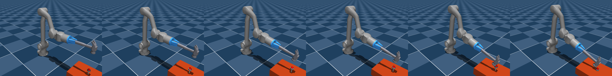
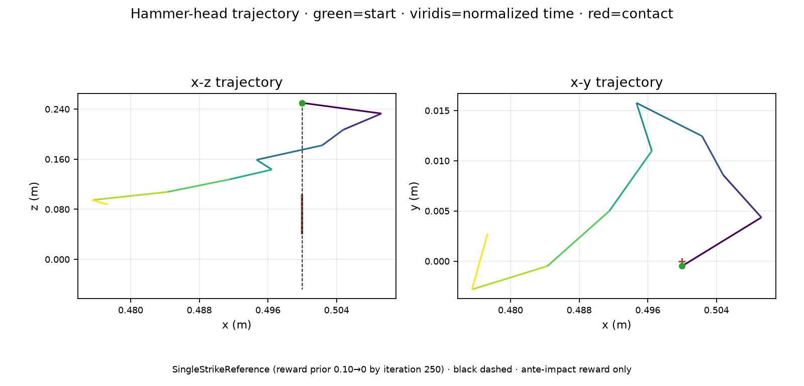
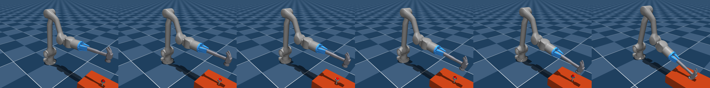
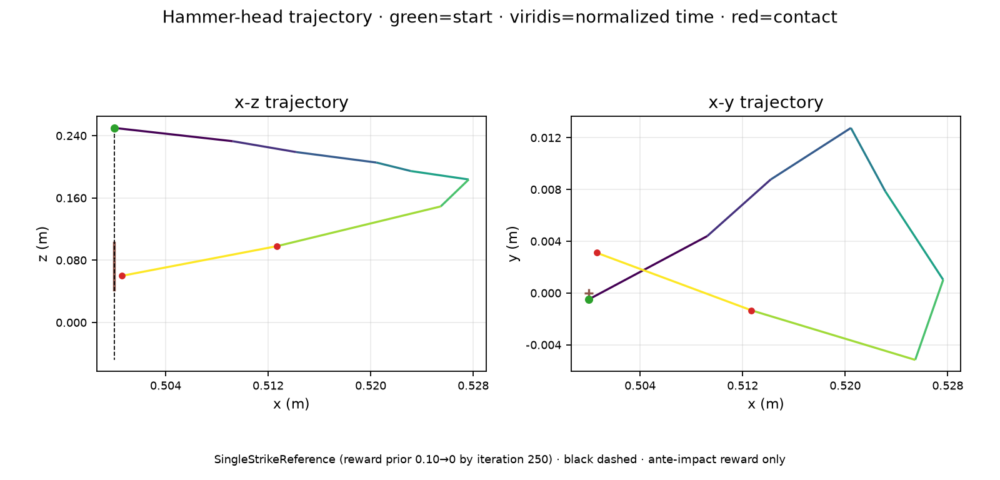

# Z1 direct-reference fixed-impedance joint policies

## Question and claim boundary

This matched simulation campaign compares two six-joint absolute-position
policies on the direct hammer-head-to-nail reference:

- **FIC-0:** fixed impedance with no target-trackability cost.
- **FIC-TT:** the same treatment plus
  `-||q_des_applied(t) - q_actual(t+1)||²`, with exactly `k_tt=1`.

The FIC-TT term is ungated through contact and remains in CaT's unscaled
negative-return partition.

The rejected RTT-Q90 calibration is absent. The independent training unit is
the training seed (`n=3` per treatment). The 64 fixed evaluation worlds are
paired measurement conditions, not training replicates. All comparisons are
descriptive; no p-value, confidence interval, or `n=192` treatment claim is
made.

## Frozen treatment and protocol

- Code: `fe9ff8b8c3debba91219b982a5252b61cd6b67b2`
- Assets: `b58ccd2f81fd246f27c1e8d88cf86484cd888703`
- Runtime: mjlab `1.4.0`, MuJoCo `3.8.1`, mujoco-warp `3.8.1`; one
  `NVIDIA A100-SXM4-40GB` per training job
- Training: seeds `2`, `3`, and `4`; `4,096` environments; `500` PPO
  iterations; final checkpoint `model_499.pt`
- Policy interface: six absolute joint-position outputs and 40 observations;
  fixed gains and fixed robot/nail reset
- Direct prior: position-only `SingleStrikeReference` from the reset hammer-head
  position through the nail top to `0.15 m` below it; `sigma=0.05 m`; reward
  weight `0.10` annealed through `0.08, 0.06, 0.04, 0.02` to zero at iteration
  `250`; no post-contact reward credit
- Delivered impulse: `D4=4.0`,
  `I_ref=0.2799950838088989 N s`, event-correct and unsaturated
- CaT: joint-velocity soft-CaT active at substep rate; per-joint impulse CaT
  measured but log-only; its project caps are
  `[1.64, 3.28, 1.64, 1.64, 1.64, 1.64] N m s`
- Evaluation: seed `2026081202`; 64 environments; first episode only;
  deterministic mean policy; no auto-reset; `4.0 s` maximum horizon
- Shared fixed-population SHA-256:
  `320efae8c21b3303c5dc3f18ae7df00e887653abf26aa8fb413803cf78d094cb`

Reference-error measurements cover reward-eligible ante-contact samples. The
`0.05 m` bandwidth is an approved permissive reward scale, not a physically
calibrated constant.

## Execution identity

| Phase | Job/index | Arm/seed | Node | Elapsed | State |
|---|---|---|---|---:|---|
| Clean CUDA qualification | `41103976` | both arms | gn01 | 00:02:12 | `COMPLETED/0:0` |
| Training/evaluation | `41104029_0` | FIC-0/2 | gn01 | 00:20:40 | `COMPLETED/0:0` |
| Training/evaluation | `41104029_1` | FIC-TT/2 | gn12 | 00:20:56 | `COMPLETED/0:0` |
| Training/evaluation | `41104394_2` | FIC-0/3 | gn01 | 00:20:11 | `COMPLETED/0:0` |
| Training/evaluation | `41104394_3` | FIC-TT/3 | gn26 | 00:20:55 | `COMPLETED/0:0` |
| Training/evaluation | `41104394_4` | FIC-0/4 | gn12 | 00:19:42 | `COMPLETED/0:0` |
| Training/evaluation | `41104394_5` | FIC-TT/4 | gn17 | 00:21:27 | `COMPLETED/0:0` |
| Fixed-reset render | `41104522` | FIC-0/2 | gn30 | 00:01:00 | `COMPLETED/0:0` |
| Fixed-reset render | `41104496` | FIC-TT/2 | gn17 | 00:01:43 | `COMPLETED/0:0` |

All six training stderr logs are empty. The renderer used a GPU allocation for
EGL but deliberately ran the policy and environment on CPU, as recorded in its
metadata. Every curriculum log contains all six registered plateaus and stays
at zero from iteration 250 through 499.

## Results

| Seed | Arm | Success | Productive | First-event impulse mean ± population SD (N s) | Mean / `I_ref` | Target RMSE mean (rad) | Episode-max target error mean (rad) | Eligible reference error mean (m) |
|---:|---|---:|---:|---:|---:|---:|---:|---:|
| 2 | FIC-0 | 64/64 | 64/64 | 0.229133 ± 0.001135 | 0.8183 | 0.247398 | 0.721520 | 0.015173 |
| 2 | FIC-TT | 64/64 | 64/64 | 0.424115 ± 0.001530 | 1.5147 | 0.170593 | 0.554494 | 0.018206 |
| 3 | FIC-0 | 64/64 | 64/64 | 0.457634 ± 0.009040 | 1.6344 | 0.176121 | 0.554499 | 0.017577 |
| 3 | FIC-TT | 64/64 | 64/64 | 0.407498 ± 0.015756 | 1.4554 | 0.165978 | 0.554488 | 0.018371 |
| 4 | FIC-0 | 64/64 | 64/64 | 0.229167 ± 0.004561 | 0.8185 | 0.248181 | 0.714985 | 0.017648 |
| 4 | FIC-TT | 64/64 | 64/64 | 0.405579 ± 0.010824 | 1.4485 | 0.165131 | 0.554494 | 0.019310 |

Every policy achieved 64/64 success and productive first strikes. FIC-TT had
lower mean joint-target RMSE in every matched seed. Its eligible reference
error was slightly higher in every seed, and delivered impulse was higher in
seeds 2 and 4 but lower in seed 3.

Every delta below is `FIC-TT - FIC-0`. Across-seed SD is the sample SD of the
three paired training-seed deltas.

| Seed | Δ target RMSE (rad) | Δ target RMSE | Δ target max (rad) | Δ impulse (N s) | Δ reference error (m) | Δ success (pp) | Δ productive (pp) |
|---:|---:|---:|---:|---:|---:|---:|---:|
| 2 | -0.076805 | -31.05% | -0.167026 | +0.194982 | +0.003033 | +0.00 | +0.00 |
| 3 | -0.010143 | -5.76% | -0.000011 | -0.050135 | +0.000794 | +0.00 | +0.00 |
| 4 | -0.083050 | -33.46% | -0.160491 | +0.176412 | +0.001662 | +0.00 | +0.00 |
| Mean ± seed SD | -0.056666 ± 0.040411 | -23.42% ± 15.34% | -0.109176 ± 0.094596 | +0.107086 ± 0.136474 | +0.001830 ± 0.001129 | +0.00 ± 0.00 | +0.00 ± 0.00 |

### Empirical constraint measurements

| Seed | Arm | Velocity-legal | Worst peak qvel (rad/s; joint) | At/below impulse cap | Worst cap utilization (joint) |
|---:|---|---:|---:|---:|---:|
| 2 | FIC-0 | 64/64 | 3.077703; joint2 | 64/64 | 9.20%; joint3 |
| 2 | FIC-TT | 64/64 | 3.106327; joint2 | 64/64 | 52.47%; joint3 |
| 3 | FIC-0 | 0/64 | 4.582265; joint6 | 64/64 | 45.31%; joint3 |
| 3 | FIC-TT | 31/64 | 4.782409; joint6 | 64/64 | 44.35%; joint3 |
| 4 | FIC-0 | 64/64 | 3.076632; joint2 | 64/64 | 9.25%; joint3 |
| 4 | FIC-TT | 64/64 | 3.077646; joint2 | 64/64 | 47.45%; joint3 |

Velocity legality is empirical for these evaluated first episodes, not a hard
guarantee. Seed 3 is a genuine qualification failure for both treatments: all
FIC-0 worlds and 33 FIC-TT worlds exceeded `3.1415 rad/s`, driven by joint6.
All 384 evaluated episodes remained below every log-only impulse cap; the
largest observed utilization was 52.47% on FIC-TT seed 2, joint3.

Impulse CaT was log-only, so below-cap observations do not show active
constraint protection or establish hardware safety.

## Qualitative fixed-reset rollouts

The seed-2 renders are qualitative fixed-reset mean-policy examples, not
outcome distributions.

Remote videos, retained on Vega:

- FIC-0: `/ceph/hpc/home/eunikhilr/campaigns/z1-fic-direct-reference/renders/fe9ff8b8c3debba91219b982a5252b61cd6b67b2/b58ccd2f81fd246f27c1e8d88cf86484cd888703/fic0_seed2_92499dac28305f1f406b8f4307114f1cb493290ef8e99771bd766a5f19d1dc0e/policy.mp4` — SHA-256 `04b9aea4c274dd6e54a179baf03f28dec46ff5bf27591cf2d69db53d2946c617`
- FIC-TT: `/ceph/hpc/home/eunikhilr/campaigns/z1-fic-direct-reference/renders/fe9ff8b8c3debba91219b982a5252b61cd6b67b2/b58ccd2f81fd246f27c1e8d88cf86484cd888703/fictt_seed2_98795c91592b9950e37cca6e8f5dfb0a50e20a9291cff89b98c63225681eb931/policy.mp4` — SHA-256 `a6fd0035193a0cd7719dcd06897f7524945a969b9b92de9e5a43b0a48f7228cb`

## Checkpoints and reproducibility

The evaluator-visible `/cephhome` prefix below and the launcher's canonical
`/ceph/hpc/home` prefix resolve to the same Vega storage.

- FIC-0 seed 2: `/cephhome/eunikhilr/campaigns/z1-fic-direct-reference/runs/fe9ff8b8c3debba91219b982a5252b61cd6b67b2/b58ccd2f81fd246f27c1e8d88cf86484cd888703/41104029_0_fic0_seed2/logs/rsl_rl/z1_hammer/2026-08-12_21-12-43_fic_direct_reference_fic0_seed2_job41104029_0/model_499.pt` — SHA-256 `92499dac28305f1f406b8f4307114f1cb493290ef8e99771bd766a5f19d1dc0e`
- FIC-0 seed 3: `/cephhome/eunikhilr/campaigns/z1-fic-direct-reference/runs/fe9ff8b8c3debba91219b982a5252b61cd6b67b2/b58ccd2f81fd246f27c1e8d88cf86484cd888703/41104394_2_fic0_seed3/logs/rsl_rl/z1_hammer/2026-08-12_21-37-06_fic_direct_reference_fic0_seed3_job41104394_2/model_499.pt` — SHA-256 `7c49de359e379b9ca0606eb7bd00d42f3a7bad5d9ee34d282be150715f86f62f`
- FIC-0 seed 4: `/cephhome/eunikhilr/campaigns/z1-fic-direct-reference/runs/fe9ff8b8c3debba91219b982a5252b61cd6b67b2/b58ccd2f81fd246f27c1e8d88cf86484cd888703/41104394_4_fic0_seed4/logs/rsl_rl/z1_hammer/2026-08-12_21-37-05_fic_direct_reference_fic0_seed4_job41104394_4/model_499.pt` — SHA-256 `91ee221d88567a6315f15ed32b90f0285f9fdfcabdce25d26de089c0fe543a62`
- FIC-TT seed 2: `/cephhome/eunikhilr/campaigns/z1-fic-direct-reference/runs/fe9ff8b8c3debba91219b982a5252b61cd6b67b2/b58ccd2f81fd246f27c1e8d88cf86484cd888703/41104029_1_fictt_seed2/logs/rsl_rl/z1_hammer/2026-08-12_21-12-54_fic_direct_reference_fictt_seed2_job41104029_1/model_499.pt` — SHA-256 `98795c91592b9950e37cca6e8f5dfb0a50e20a9291cff89b98c63225681eb931`
- FIC-TT seed 3: `/cephhome/eunikhilr/campaigns/z1-fic-direct-reference/runs/fe9ff8b8c3debba91219b982a5252b61cd6b67b2/b58ccd2f81fd246f27c1e8d88cf86484cd888703/41104394_3_fictt_seed3/logs/rsl_rl/z1_hammer/2026-08-12_21-37-17_fic_direct_reference_fictt_seed3_job41104394_3/model_499.pt` — SHA-256 `22030578376c299e387539d0633d0f48d2367c14ca626204c0d2befc789fd6de`
- FIC-TT seed 4: `/cephhome/eunikhilr/campaigns/z1-fic-direct-reference/runs/fe9ff8b8c3debba91219b982a5252b61cd6b67b2/b58ccd2f81fd246f27c1e8d88cf86484cd888703/41104394_5_fictt_seed4/logs/rsl_rl/z1_hammer/2026-08-12_21-37-19_fic_direct_reference_fictt_seed4_job41104394_5/model_499.pt` — SHA-256 `af55b00338331fec8ddf320e9a490485f22c4894f7099bd220d5b5a3658aed58`

The banked directory contains only six evaluation JSONs, six curriculum JSONs,
four PNGs, and a sorted `SHA256SUMS`. All six checkpoint bytes were rehashed on
Vega and matched their evaluator records.

## Verification, interpretation, and stopping boundary

The exact qualified code passed focused reward/contact/reference tests, both
CPU one-iteration CatPPO smokes, and a clean A100 CUDA qualification with both
CUDA CatPPO updates finite. One full CPU suite invocation produced `2769
passed, 4 skipped, 1 failed`; the only failure was Warp's sandbox-blocked user
cache path. The exact failed controlled-drop test then passed after redirecting
Warp's kernel cache to `/private/tmp`. The full suite was not rerun.

Implementation review passed repository Standards and Spec. Opus passed its
available implementation slice; DeepSeek passed through the final substantive
implementation changes. Gemini was unavailable (configured model/quota), so a
separately labeled GPT-5.6 ultra substitute implementation review passed
instead. The final result package passed fresh repository Standards, Spec, and
independent provenance/numerical reviews. The identical final external package
was offered to Opus Max, Gemini, and DeepSeek; none was callable at that time
(session limit, exhausted quota, and unavailable model respectively), so no
external-provider verdict is claimed for the final evidence-only commit.

The defensible result is that FIC-TT improved its intended endpoint—joint-target
tracking—across all three matched seeds without reducing task completion. It is
the stronger basis for a later VIC treatment. This is not a universal policy
ranking: impulse varied by seed, reference error rose slightly, and seed 3
failed the empirical velocity threshold in both arms.

No Cartesian-versus-joint or waypoint-versus-reference causal comparison is
made. The campaign stops before active impulse-CaT, VIC, and further
controlled-drop experiments.
