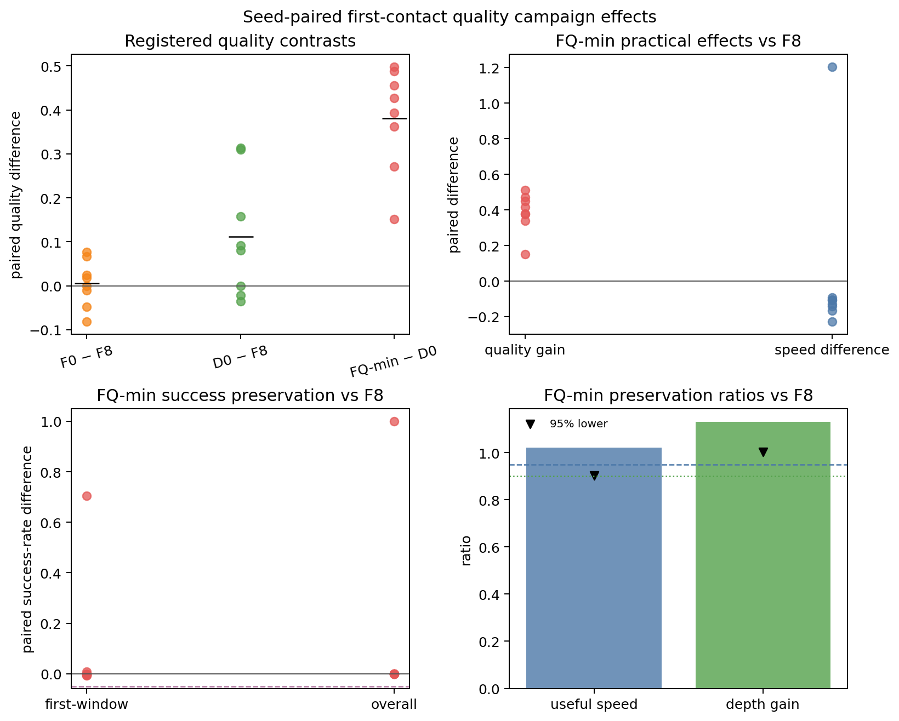
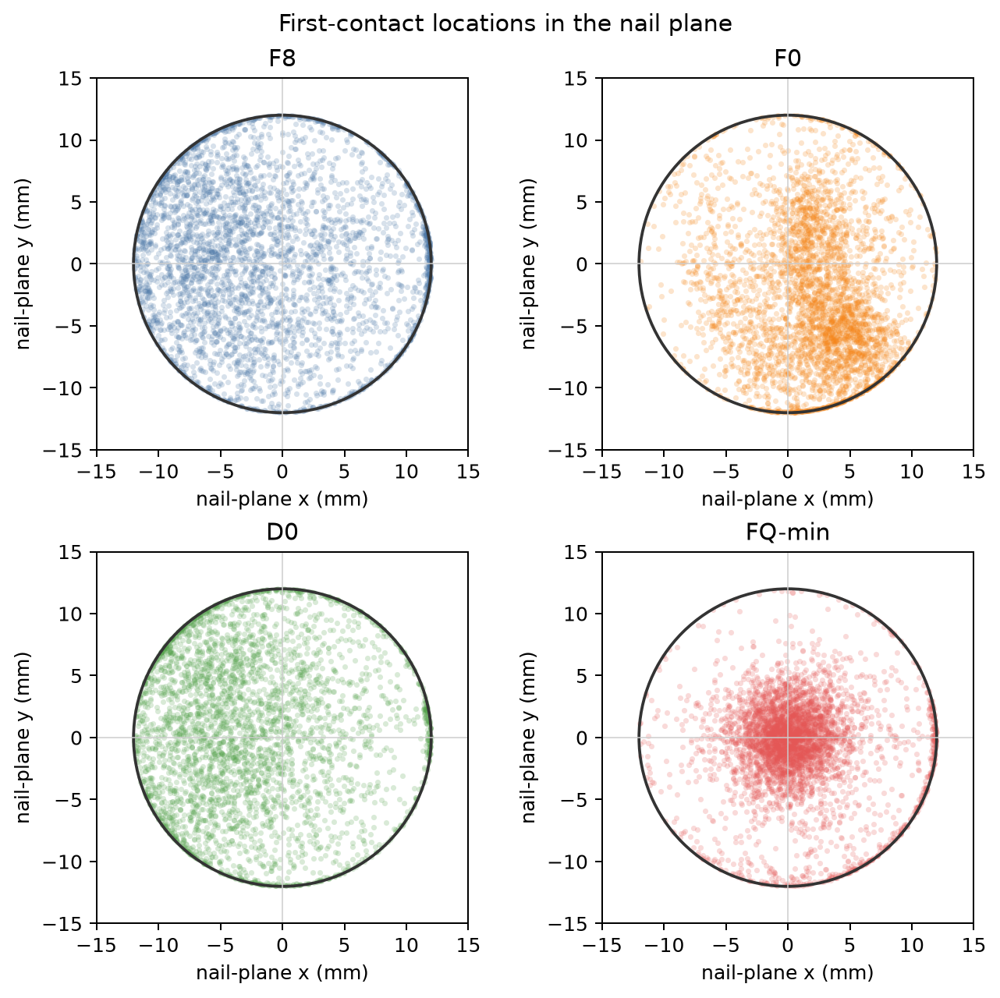

# fq4x8 Task-9 matched-ratio correction

## Why this correction exists

The completed fq4x8 Task-9 analysis rejected a matched bootstrap ratio whenever
any individual control-seed summary was zero. The frozen design defines the
ratio on each resampled **arm mean**; it should fail only when an observed or
resampled control-arm mean is nonpositive or nonfinite. F8 seed 12 is zero,
but every registered 100,000-sample PCG64 bootstrap arm mean is positive.

The production helper was corrected at
`c4ecfb6bbd42204dd92d8b2adc8af6282e94e9fe` and covered by focused tests for
both a permissible zero seed and a truly zero resampled denominator.

## Corrected values

| Registered ratio | Estimate | One-sided 95% lower bound | Gate |
|---|---:|---:|---:|
| FQ-min / F8 useful speed | 1.020483 | 0.903143 | fail (`>0.95`) |
| FQ-min / F8 depth gain | 1.130463 | 1.003629 | pass (`>0.90`) |
| D0 / F8 depth gain | 0.991462 | 0.988661 | pass (`>0.90`) |

The previously unavailable depth-ratio gates are now correctly true.
Nevertheless, **FQ-min practical replacement remains rejected** because its
useful-speed lower bound is below 0.95. The **D0 mechanism claim remains rejected** because its
preregistered success guardrails fail. The primary
contrasts, Holm family, sign-flip results, all 32 seed aggregates, 14,846 valid
contact coordinates, and overall decisions are unchanged.

## Method and provenance

No Vega rerun was needed. The SHA-pinned historical `analysis.json` already
contained the sufficient statistics for all 32 seeds and 16,384 sampled
episodes; its exact bytes are retained as `source_analysis.json.gz`. The three
ratios and dependent booleans were recomputed locally with
the registered `numpy.random.PCG64` seed `20260726` and 100,000 matched
resamples. The corrected JSON differs from the historical bundle at exactly 23
leaves under five registered roots; `provenance.json` enumerates them.

`analysis.json.gz` is a deterministic gzip representation of the corrected
JSON. The paired-effects plot was regenerated with the correction runtime. The
aggregate contact map is copied byte-for-byte from the historical Task-9
bundle because its underlying data did not change; its original Matplotlib
producer version is recorded separately so the runtime provenance is not
ambiguous.

The package is verified by its sorted `SHA256SUMS`. This correction does not,
by itself, justify deleting any reward term from the current direct-reference
FIC/VIC stack; the fq4x8 campaign used older Cartesian fixed-impedance
machinery and only nominates later controlled-ablation candidates.
