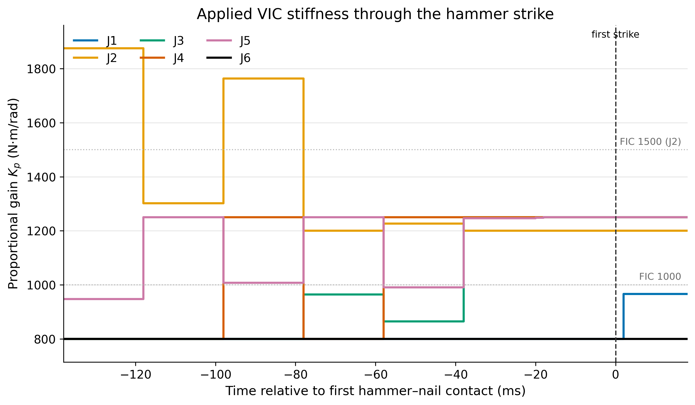

# Z1 native VIC-TT seed-2 engineering canary

## Claim boundary

This is the first full-scale training and deterministic evaluation of the
native 12-output Z1 variable-impedance controller. It is a **one-seed engineering result**:
it shows that the frozen VIC-TT treatment can train,
save, reload, execute bounded joint-specific gains, and complete the hammering
task. It is **not evidence that VIC is superior** to fixed impedance, that the
behavior replicates across training seeds, or that the gain schedule caused
the task outcome.

The per-joint impulse quantity was measured, but **impulse CaT was log-only**.
Below-cap measurements therefore do not establish active impulse enforcement
or hardware safety.

## Frozen execution

- Qualification job: `41109346`, `COMPLETED/0:0` in 2m16s
- Training job: `41119011`, `COMPLETED/0:0` in 23m27s on one A100
- Code: `ca5e83bc84bc979bac857088a9330f2a2bd8034b`
- Assets: `b58ccd2f81fd246f27c1e8d88cf86484cd888703`
- Training: seed `2`, 4,096 environments, 500 PPO iterations
- Final checkpoint: `model_499.pt`, SHA-256
  `c1544b779e78e7323bf02ce7b0f165745ee63b5aad9f930f9eea64eb6ea4ea77`
- Evaluation: 64 fixed worlds, deterministic mean policy, first episode only,
  no auto-reset, seed `2026081202`, 500 Hz physical readout

## Result

| Endpoint | Seed-2 VIC-TT result |
|---|---:|
| Success | 64/64 |
| Productive first strike | 64/64 |
| First-event delivered impulse | 0.451821 ± 0.004959 N s |
| Joint-target RMSE | 0.174553 rad |
| Worst observed joint speed | 3.105227 rad/s |
| Empirically velocity-legal | 64/64 |
| At or below every impulse cap | 64/64 |
| Worst impulse-cap utilization | 49.46% (joint 3) |

The 64 worlds are a fixed evaluation population, not 64 independent training
replicates. The absolute behavior gates passed for this seed. Formal
controller comparison requires matched multi-seed treatments and must account
for the 6-output FIC versus 12-output VIC PPO dimensionality.

## Gain contract and observed schedule

For each joint, the policy emits `p_j in [-1, 1]` and the native gains are

`Kp_j = Kp0_j * 1.25^p_j`,

`Kd_j = Kd0_j * sqrt(1.25^p_j)`.

Thus the provisional Z1 envelope is 0.8–1.25 times nominal for `Kp` and
`sqrt(0.8)`–`sqrt(1.25)` times nominal for `Kd`.

| Joint | FIC nominal Kp / Kd | Allowed VIC Kp / Kd | Observed deterministic Kp min / mean / max |
|---|---:|---:|---:|
| J1 | 1000 / 100 | 800–1250 / 89.44–111.80 | 800 / 821.35 / 1019.49 |
| J2 | 1500 / 150 | 1200–1875 / 134.16–167.71 | 1200 / 1372.18 / 1875 |
| J3 | 1000 / 100 | 800–1250 / 89.44–111.80 | 800 / 997.36 / 1250 |
| J4 | 1000 / 100 | 800–1250 / 89.44–111.80 | 800 / 1081.25 / 1250 |
| J5 | 1000 / 100 | 800–1250 / 89.44–111.80 | 910.89 / 1148.25 / 1250 |
| J6 | 1000 / 100 | 800–1250 / 89.44–111.80 | 800 / 800 / 800 |

At first hammer–nail contact, the median gains across the 64 worlds were:

| Joint group | FIC Kp / Kd | VIC median Kp / Kd at first contact | Descriptive change |
|---|---:|---:|---|
| J1, J6 | 1000 / 100 | 800 / 89.44 | lower Kp |
| J2 | 1500 / 150 | 1200 / 134.16 | lower Kp |
| J3–J5 | 1000 / 100 | 1250 / 111.80 | higher Kp |

This is a joint-specific impact pattern, not a whole-arm “hard–soft–hard”
sequence. Gains update at 50 Hz and are held for ten 2 ms physics substeps, so
the first-contact values were commanded before contact. Success terminates the
evaluated episode at the next controller boundary while contact is still live;
post-separation recovery was not observed. Training-rollout telemetry shows
nonzero gain spread across the training population, while the final
deterministic evaluation held J6 at its lower bound throughout; both facts are
reported rather than merged into a stronger claim.

The presentation render is qualitative and deliberately slowed for visual
inspection:

- [VIC-TT seed-2 rollout video](assets/2026-08-14_z1_vic_seed2_canary/presentation/policy.mp4)
- [Rollout montage](assets/2026-08-14_z1_vic_seed2_canary/presentation/montage.png)
- [End-effector trajectory](assets/2026-08-14_z1_vic_seed2_canary/presentation/trajectory.png)

## Reproducibility and next boundary

The compact bank contains the final checkpoint, frozen evaluator, evaluation
and training-telemetry JSON, exact Kp trace, presentation assets, and a sorted
`SHA256SUMS`. `victt_seed2_eval.json` is the authority for the headline
behavior endpoints and whole-rollout gain statistics above. The contact-aligned
Kp trace comes from a separate instrumented replay of the same checkpoint and
frozen population (`victt_seed2_kp_trace_eval.json` plus
`victt_seed2_kp_trace.npz`); its independently repeated behavior summary is not
substituted into the headline table.

Next work is separate impulse-CaT attribution and calibration: expose velocity
and impulse deltas independently, then determine whether the real impulse caps
bind before enabling active impulse pressure. No additional VIC seeds or
performance claim follows automatically from this canary.
